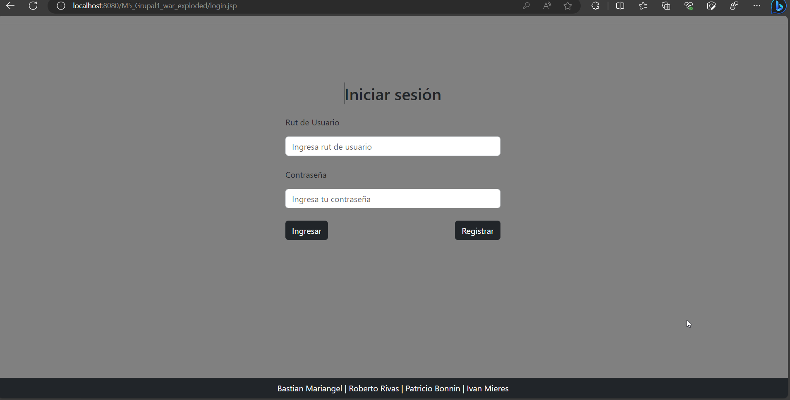
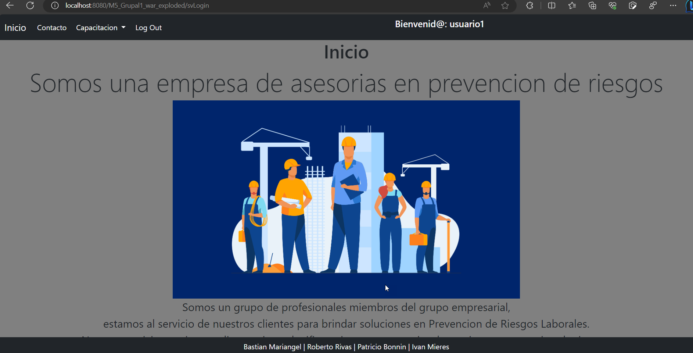
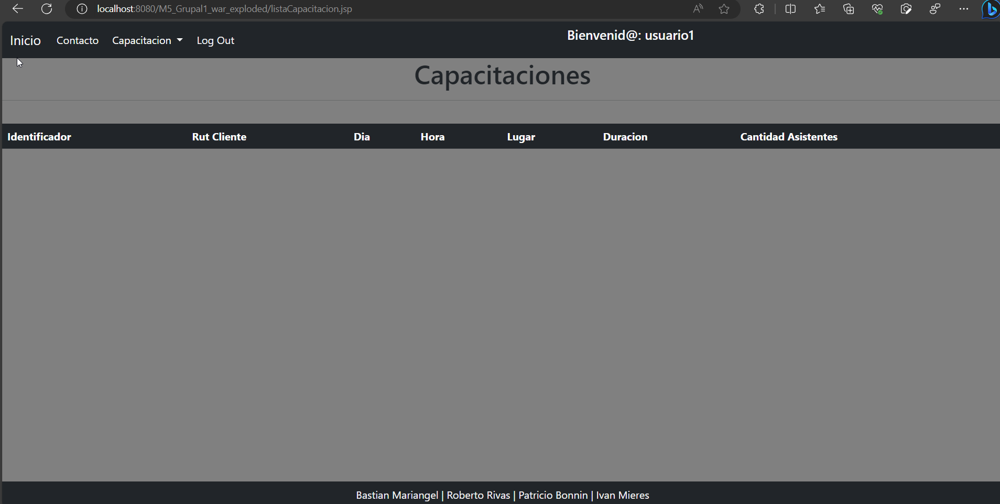
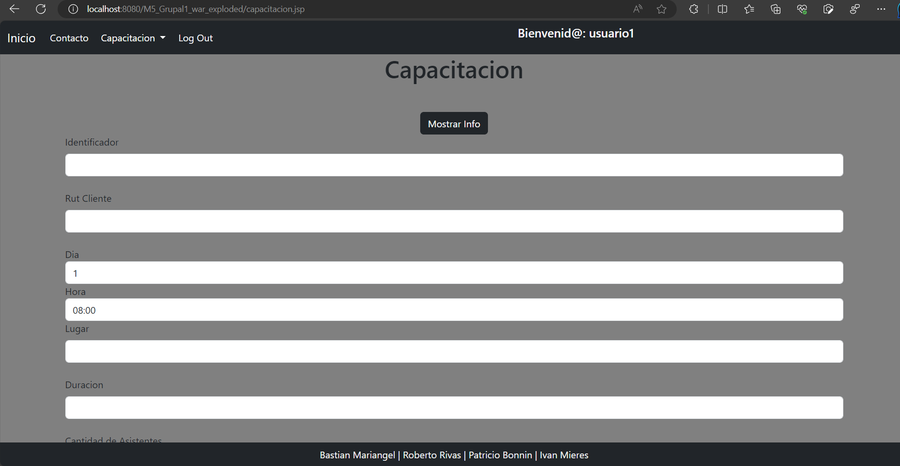
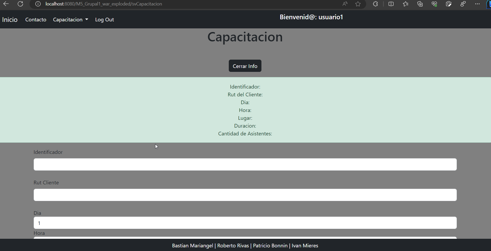
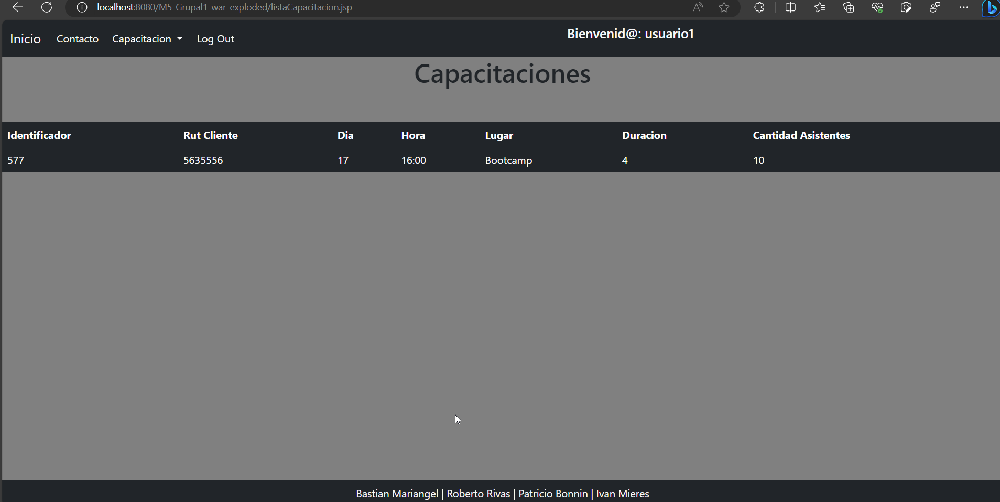
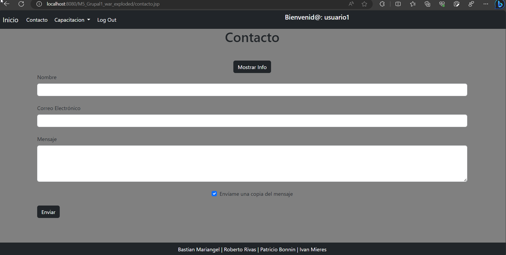
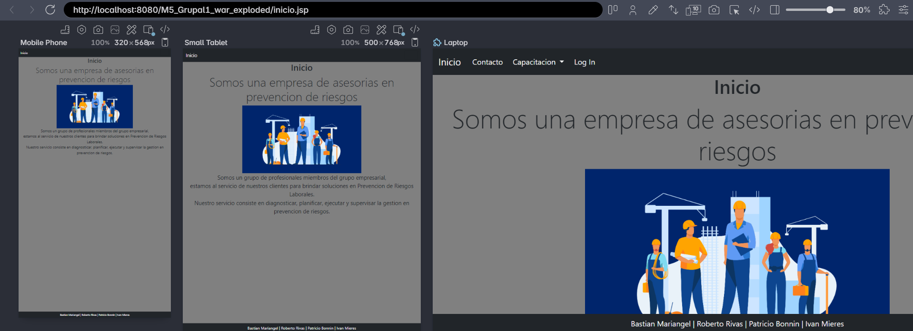

| Desarrollo de aplicaciones web dinámicas                                    
| Tema: Java Server Pages
| Intención del aprendizaje o aprendizaje esperado                                 
|    Construye un Servlet que rescata información de un request GET/POST utilizando tecnología Java acorde al estándar J2EE.  Construye una vista JSP que despliega información provista por un Servlet utilizando tags JSTL para el formateo acorde al estándar J2EE.                                    

| Planteamiento del Problema:                                

|   Una empresa de asesorías en prevención de riesgos necesita contar con un sistema de información que le permita administrar los principales procesos que se llevan a cabo en ella día a día.  Hasta el momento se han definido las siguientes funcionalidades en el sistema:  **ID Nombre Detalle Actor(es)** 1 **Inicio** Página de inicio del portal con Cliente / información relevante del proyecto Administrativo / que se está realizando. Profesional 2 **Contacto** Formulario de contacto para realizar Cliente consultas. 3 **Crear Capacitación** Formulario para crear una Cliente capacitación en el sistema. 4 **Listar Capacitaciones** Listado de capacitaciones registradas. Cliente 5 **Listado de Usuarios** Listado con los usuarios existentes en Administrativo plataforma. 6 **Crear Usuario** Formulario que permitirá crear un Administrativo usuario en sistema. 7 **Editar Cliente** Formulario que permite modificar los Administrativo datos de un usuario de tipo cliente. 8 **Editar Administrativo** Formulario que permite modificar los Administrativo datos de un usuario de tipo administrativo. 9 **Editar Profesional** Formulario que permite modificar los Administrativo datos de un usuario de tipo profesional. 

| 10  | **Listado Visitas**            | Lista de todas las visitas realizadas a cada uno de los clientes. Además, posee un formulario que permite agregar nuevas visitas a sistema.                                             | Profesional                            |
| --- | ------------------------------ | --------------------------------------------------------------------------------------------------------------------------------------------------------------------------------------- | -------------------------------------- |
| 11  | **Responder checklist**        | Listado de chequeos de una visita.                                                                                                                                                      | Profesional                            |
| 12  | **Listado Pago**               | Lista de todos los pagos realizados por los clientes.                                                                                                                                   | Administrativo                         |
| 13  | **Crear Pago**                 | Permitirá agregar un pago al sistema.                                                                                                                                                   | Administrativo                         |
| 14  | **Listado Asesorías**          | Lista con las asesorías realizadas hasta el momento.                                                                                                                                    | Profesional                            |
| 15  | **Crear Asesorías**            | Contiene un formulario para agregar una nueva asesoría.                                                                                                                                 | Profesional                            |
| 16  | **Reportes**                   | Despliega reportes específicos.                                                                                                                                                         | Profesional                            |
| 17  | **Administrar** **Asistentes** | Administración de asistentes a una capacitación; incluye listarlos, poder agregar asistentes y eliminarlos.                                                                             | Cliente                                |
| 18  | **Login**                      | Contendrá un acceso a un usuario al portal a través de un RUT de usuario y una clave.                                                                                                   | Cliente / Administrativo / Profesional |
| 19  | **Gestionar accidentes**       | Listado con todos los accidentes registrados en plataforma. Además, permite editarlos, agregar uno nuevo y eliminarlos. En esta sección cada cliente administra sus propios accidentes. | Cliente                                |
| 20  | **Administrar chequeos**       | Permite mostrar los distintos chequeos realizados a cada cliente en una visita a terreno, y permite agregar uno nuevo, y cambiar su estado.                                             | Administrativo                         |

En el ejercicio de la sesión anterior, se crearon servlets para los siguientes casos de uso:

 Inicio

 Contacto

 Crear Capacitación

 Listar Capacitación

 Login

Como parte de este ejercicio se pide realizar lo siguiente:

1\. En caso de que algún servlet esté generando código HTML directamente, debe modificar este comportamiento utilizando un JSP adecuado al caso.

2\. Debe aplicar estilos CSS a cada sitio. Todos los archivos JSP deben compartir el mismo

archivo de estilos.

3\. En caso de que aplique, implemente funciones Javascript, jQuery o librerías que contengan funcionalidades pertinentes a los casos de uso implementados.

4\. Todas las páginas deben compartir el mismo menú, a excepción del login.

5\. Finalmente, implemente un servlet que permita cerrar la sesión de usuario, y redireccionar al usuario al sitio de login.

| El entregable debe ser un proyecto web dinámico Java comprimido en formato RAR o ZIP.   **Nota 1:** Este ejercicio es la continuación del ejercicio grupal del día anterior.                                                                   -|
| El Datos de apoyo al planteamiento                                                                                                                      |
|   **Ejecución**: Grupal (equipo de no más 4 personas)   **Componentes para evaluar**: Se deberá entregar un proyecto Java web dinámico, comprimido en formato ZIP o RAR.                                                                        
| Recursos Bibliográficos:                                                           

|   **Qué es Java Enterprise (J2ee, JEE)** <https://www.fundesem.es/bt/publicacion-java-ee-y-el-desarrollo-web-un-enfoque-de-aprendizaje>  **Qué son los Servlets** [https://users.dcc.uchile.cl/\~jbarrios/servlets/general.html](https://users.dcc.uchile.cl/~jbarrios/servlets/general.html)  **Utilizando métodos post y get** [https://www.ecodeup.com/enviar-parametros-servlet-desde-una-vist a-utilizando-post-get/](https://www.ecodeup.com/enviar-parametros-servlet-desde-una-vist%20a-utilizando-post-get/)  **Sesiones y cookies** <https://ricardogeek.com/manejo-de-sesiones-y-cookies-en-servlets-java/>  **Etiquetas JSTL** <http://www.jtech.ua.es/ayto/ayto2008/jsp/sesion07-apuntes.html> 

**Ejercicio Grupal 2 Modulo 5**

## **Integrantes :**

</table>

<tr>

<td></td>

<td></td\>

<td></td>

<td></td>

<td></td>

</tr>

</table>

Aplicación web Java que utiliza servlets para el registro de usuarios, el inicio de sesión y otras funciones.

svRegister.java : este servlet parece manejar el registro de usuarios. Extrae el nombre de usuario y la contraseña de los parámetros de la solicitud, crea un nuevo Usuarioobjeto, lo agrega al archivo Contenedor.listaUsuarioy luego reenvía la solicitud a la página de inicio de sesión. Es importante validar la entrada del usuario y manejar posibles excepciones o errores en una aplicación de producción.

svLogout.java : este servlet maneja el cierre de sesión del usuario. Elimina el usuarioConectadoatributo de la sesión y redirige al usuario a la página de inicio de sesión. Es una buena práctica asegurarse de que la sesión se invalide para mejorar la seguridad.

svLogin.java : este servlet maneja el inicio de sesión del usuario. Comprueba si el nombre de usuario y la contraseña proporcionados coinciden con alguna entrada del archivo Contenedor.listaUsuario. Si se encuentra una coincidencia, establece el usuarioConectadoatributo true y reenvía al usuario a la página "inicio.jsp"; de lo contrario, configura usuarioConectadoy falsereenvía al usuario a la página de inicio de sesión.

svInicio.java : este servlet no parece tener un propósito específico en el código proporcionado. Simplemente muestra un mensaje que indica que es "Presentado en: [ruta de contexto]". Es posible que desee agregar funcionalidad a este servlet si pretende hacer algo específico.

svContacto.java : este servlet maneja el envío de un formulario de contacto. Extrae el nombre, el correo electrónico y el mensaje del usuario, los establece como atributos de solicitud y reenvía la solicitud a una página "contacto.jsp". Asegúrese de validar y desinfectar adecuadamente las entradas de los usuarios para evitar vulnerabilidades de seguridad.

SvCapacitacion.java : este servlet parece manejar el envío de un formulario relacionado con "Capacitacion". Crea un nuevo Capacitacionobjeto y lo agrega a Contenedor.listaCapacitacion. Al igual que en el Servlet anterior, la validación de la entrada es crucial aquí.

Modelos : el código define varias clases que representan modelos de datos como Usuario, Contactoy Capacitacion. Estas clases contienen los datos utilizados en su aplicación. Es bueno tener clases de modelos separadas para una mejor organización.

En general, su código demuestra el uso de Servlets para manejar diferentes aspectos de una aplicación web. Sin embargo, es importante considerar aspectos de seguridad como la validación de entradas, el hash de contraseñas y la gestión de sesiones para garantizar que la aplicación sea sólida y segura.
